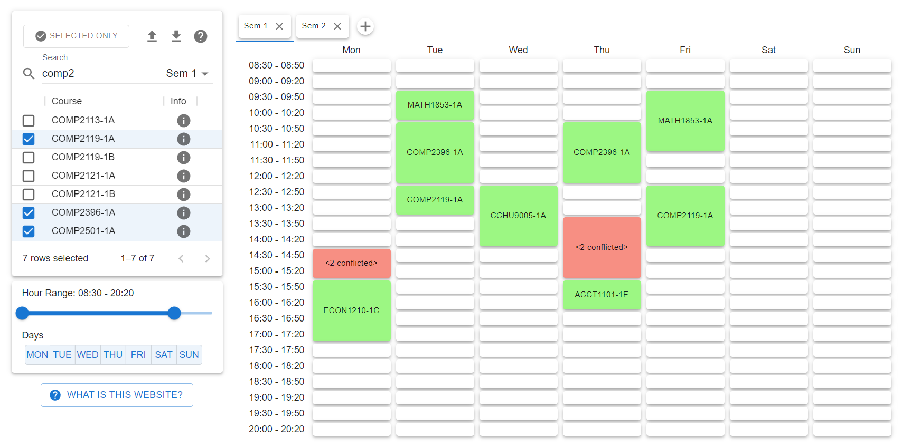

# [HKU Timetable Viewer](https://lioqing.github.io/hku-timetable-viewer/)

Click the heading above to visit the web app.

This is a web app to view and plan your timetable given the class timetable excel file found in HKU portal SIS.

https://github.com/LioQing/hku-timetable-viewer/assets/46854695/7a87212f-e650-46a3-83a9-cb048bbbe26c

